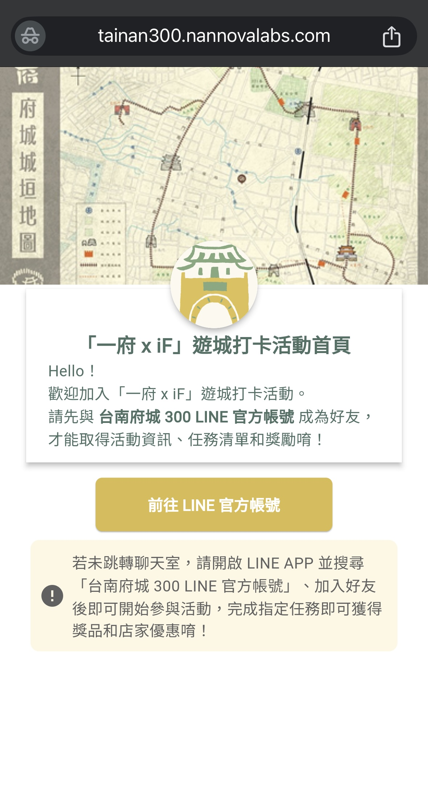
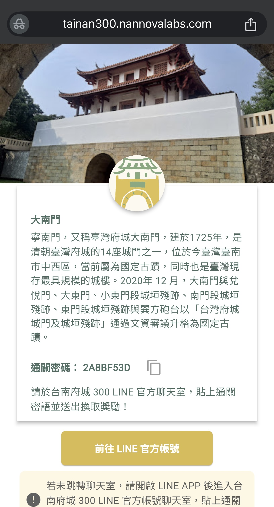

# Tainan iF 300 Web App - Product Design

**Bringing Tainan's 300th Anniversary to Life with Digital Innovation!**

The Tainan iF 300 Web App is a comprehensive platform designed to help users engage with and explore the rich historical and cultural heritage of Tainan, Taiwan. Launched as part of the "iF 300" movement, the app celebrates the 300th anniversary of Tainan’s founding in 2025 by providing an interactive experience for tourists visiting historical landmarks.  

By offering a centralized platform that consolidates information, guides, and maps related to Tainan's iconic sites, the project aims to:
- **Preserve and Promote Cultural Heritage**: Provide detailed historical context and stories behind Tainan’s key landmarks.
- **Improve Accessibility**: Make information easily accessible to a wider audience, regardless of location.
- **Enhance Visitor Experience**: Provide an engaging, interactive expnerience with real-time data and personalized suggestions for visitors.
- **Support Tourism and Local Businesses**: Encourage tourism and help boost the local economy by providing information on nearby businesses and attractions.

## 🎯 Key Features
- **QR Code Check-ins**: Tourists scan QR codes at designated landmarks to receive a unique passcode.
- **LINE Integration**: Users receive their passcodes directly via the organization's **LINE Official Account**.
- **Point & Coupon Collection**: Passcodes can be used to redeem **points and exclusive coupons** within the LINE app.
- **Enhancing Cultural Engagement**: Encouraging visitors to explore and interact with Tainan's rich history through a gamified experience.

## 🛠️ Tech Stack
- **Frontend**: Flutter Web
- **Backend**: Firebase (Cloud Functions, Firestore, Storage)
- **API**: LINE Messaging API
- **Deployment**: Cloudflare

## 📅 Timeline
- **March 2025**: Beta testing with limited users
- **April 2025**: Final refinements & official launch preparations
- **May 2025**: 🎊 **Official launch during Tainan iF 300 event!**

## 👀 Sneak Peek
<table>
  <tr>
    <td></td>
    <td></td>
    <td></td>
  </tr>
</table>

## 🤝 Contributors
- **@jcl77777** – Product Owner / Business Strategy & Development
- **@Singyuliu** – Product Design & Management
- **@here-comes-ivy** – App Development & API Integration

---

Stay tuned for updates as we bring this project to life! 🥳
